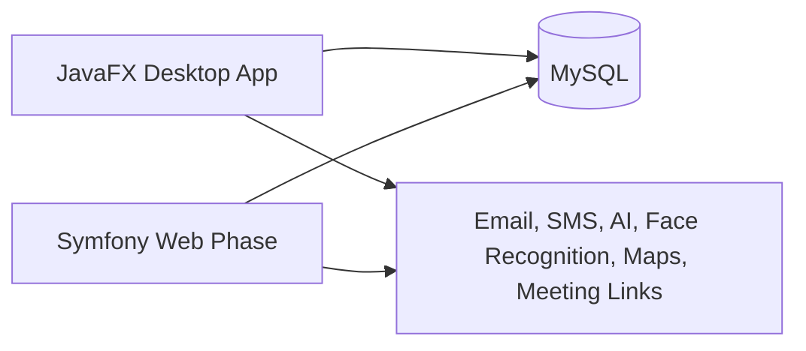

# Talent Bridge

Talent Bridge is a recruitment management platform developed as an ESPRIT integrated project. The repository combines a JavaFX desktop application and the foundation for a Symfony web phase around a shared hiring workflow: job offers, applications, interviews, events, and role-based access.

## Project Scope

- Candidate, recruiter, and administrator workflows
- Job offer publishing and application tracking
- Interview scheduling, feedback, and meeting-link generation
- Recruitment events and analytics dashboards
- AI-assisted features for screening, matching, moderation, and cover-letter support
- Notifications and communication flows across the hiring process

## Architecture



## Stack

- Java 17
- JavaFX 17 with FXML and CSS
- Maven
- MySQL 8
- Symfony 6 and PHP 8
- Jakarta Mail, PDFBox, jBCrypt, Jackson, org.json
- Luxand FaceSDK, Nominatim, Jitsi, ESCO Skills API

## Technical Highlights

- Role-based application structure across user, job offer, application, interview, and event modules
- Shared relational model for desktop and web workflows
- Service layer handling persistence, validation, notifications, and AI-assisted features
- Multiple external integrations for email, SMS, geocoding, face recognition, and recommendation logic

## Repository Layout

```text
src/main/java/
  Controllers/   application, event, interview, offer, and user controllers
  Models/        domain models for users, offers, applications, events, and interviews
  Services/      business logic, notifications, matching, moderation, and analytics
  Utils/         database access, validation, and session context
src/main/resources/
  views/         JavaFX FXML views
  rh.sql         database schema
  styles.css     shared styling
```

## Project Context

- University project developed at ESPRIT
- Desktop phase implemented in JavaFX
- Web phase positioned as a Symfony extension of the same platform
- Designed as a multi-role system rather than a single-user CRUD app

## Notes

- The repository contains the desktop application source and supporting resources for the broader platform
- The web phase is part of the project direction, but repository maturity is centered on the Java application
